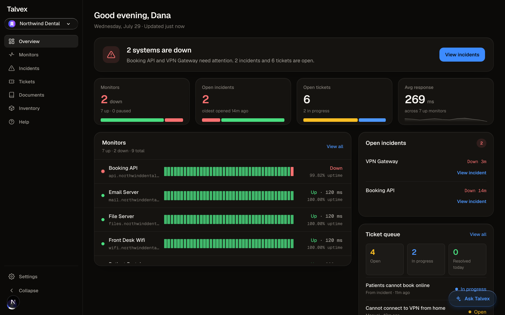
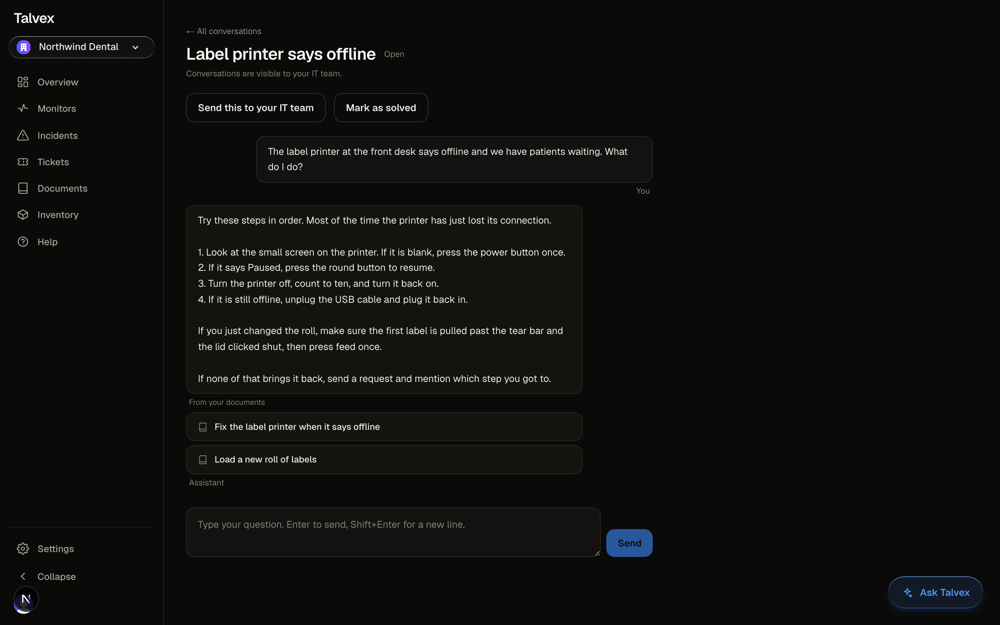

# Talvext

**Live: https://talvex-chi.vercel.app** · [Architecture](docs/ARCHITECTURE.md) · [Technical write up](docs/WRITEUP.md) · [Decisions](docs/DECISIONS.md) · [Runbook](docs/RUNBOOK.md) · [Requirements](docs/BRD.md)

When a small office's booking system goes down, the people who notice are the
staff, and the person who has to fix it usually finds out last. Talvext closes
that gap: it watches the systems, opens the incident itself, tells the right
human by email and Discord, answers the staff questions it can answer from the
office's own written documents, and turns the rest into tickets. One
organization's data is separated from another's by the database, not by
application code that has to remember.





Both screenshots are the running app against a seeded demo organization. No
mockups, and nothing on screen that the product does not do.

---

## Architecture

The diagram is in [docs/ARCHITECTURE.md](docs/ARCHITECTURE.md) and the narrative
behind these choices is in [docs/WRITEUP.md](docs/WRITEUP.md). Every line here
describes something on `main` today.

**Tenancy is enforced at the database.** Every table holding organization data
has row level security on, with policies that resolve the caller's organization
from their Clerk token, so a query for another organization's rows returns
nothing rather than being trusted not to ask.

**Grants are scoped to columns, not just tables.** Beyond the row policies,
each role is granted the exact verbs and columns it needs: an admin may update
`org_members.role` but not reassign the membership, an anonymous status page
visitor may read an organization's `id`, `name`, and slug and nothing else, and
the encrypted API key column is withheld from every signed in session's select
grant entirely.

**The database column is the role authority, not the token claim.** Clerk
issues the session and a role claim rides in it, but `is_org_admin()` answers
by reading the `org_members` row the webhook maintains, so a stale or forged
claim changes nothing about what a caller may do.

**AI provider keys live in an application layer vault.** Each organization
brings its own Anthropic, OpenAI, or Google key; it is encrypted with AES 256
GCM before it reaches Postgres, the ciphertext is unreadable through any user
session, and it is decrypted only in request scope on the server at the moment
of a provider call.

**A sweep drives monitoring, and a pure state machine drives incidents.** An
external scheduler calls an authenticated endpoint every five minutes; the
sweep checks whichever monitors are due, and hands each result to an engine
that decides, with no input or output of its own, whether this is a blip, a
confirmed outage worth opening, a recovery, or a flap inside the cooldown.

**The support chat can only cite what the person asking could already read.**
Retrieval runs on the client built from the asking user's own session, so
document visibility, audience tags and all, is applied by the database before
any code in the retrieval path sees a row.

**The audit log is append only, and the database is what makes it so.**
Sensitive actions fan out into one organization wide log through triggers, so
the record is written in the same transaction as the change; signed in sessions
hold select and nothing else, and a trigger refuses every update and every
delete on top of that, **including from the service role**, which grants alone
could not have stopped.

**The platform reports its own liveness, and something outside it watches.**
The sweep stamps a heartbeat row, a public endpoint answers 200 or 503 on
whether that stamp is fresh, and a scheduled GitHub workflow polls that
endpoint every thirty minutes from outside the deployment, because the sweep
cannot report its own death.

Talvext also monitors Talvext and publishes a status page at
[`/status/talvex`](https://talvex-chi.vercel.app/status/talvex). That catches a
dead deployment or a dead database. It **cannot** catch a dead sweep, because
its own monitors are checked by that sweep; the GitHub workflow is what catches
that. The distinction is kept deliberately in
[docs/RUNBOOK.md](docs/RUNBOOK.md) so it is never quietly collapsed.

---

## How this is verified

**The isolation suite proves tenancy against a real database.** 358 tests
across 18 files run against a real Postgres with the real policies, started
from the migrations and applied from zero, with tokens minted in both Clerk
claim shapes. It is not mocked, because a mock would prove nothing about a
policy, and it never skips: when the local stack is not running it fails with
the command that fixes it.

**A test that cannot fail proves nothing, so the suite is built to be able to
fail.** Every cross tenant probe runs against rows that were genuinely written
first, through the service role, so an empty result means a policy filtered
something real rather than that there was nothing to find. The environment
hygiene guard was checked the same way, by planting a realistically shaped key
in `.env.example`, confirming the test went red, and then removing it.

**The whole suite is 899 tests across 62 files**, run on every pull request
alongside a typecheck and lint. Because the isolation job boots the stack from
`supabase/migrations/`, every pull request also proves the 18 migrations replay
cleanly into an empty database.

**Accessibility is a published commitment, so it is checked rather than
claimed.** The public statement at `/accessibility` targets WCAG 2.2 Level AA,
and four things hold it up. No state is ever conveyed by color alone: the five
status shapes in `src/components/status-mark.tsx` stay distinct, so up and down
are separable without seeing red or green. One focus ring token applies
globally through `:focus-visible`, and `outline-none` is banned in a test
because the CSS layer order means that utility would silently beat the rule.
`eslint-plugin-jsx-a11y` runs in the lint job. And `tests/e2e/accessibility.spec.mjs`
runs axe over the real running app, nine pages signed out and in, failing on
any serious or critical violation, with zero rule exclusions. The guards were
checked by breaking what they protect: collapsing two status shapes and
stripping `aria-hidden` both turn the suites red.

**End to end specs drive the real screens with real Clerk sessions.** Seven of
the twelve Playwright specs sign in through Clerk's testing integration and
click through the actual product, including publishing a document and watching
a tagged member get a citation for it while an untagged member gets none. The
others cover surfaces that have no session to sign into: the landing page, the
legal pages, the health endpoint, and the public status page. All of them need a built app,
and the signed in ones need a seeded organization, so they are run deliberately
rather than on every pull request.

**A CI job fails the build when a merged migration is not applied to the live
database.** It compares the migrations on the base branch, the migrations in
the checkout, and the versions the database records, and it deliberately does
not fail a pull request for the migration that pull request is adding. **It is
never merged over.** When it went red on a landing where the fix was understood
and self resolving, the answer was still to reshape the work until it went
green, because a guard overridden once because the override was defensible is a
guard whose next override only has to be defensible too
([the 2026-07-30 ruling](docs/DECISIONS.md)).

**The restore procedure has actually been run.** A dump was restored into a
clean stack on 2026-07-30, and the assertion was not that the commands exited
zero but that the isolation suite passed against the restored data, which
exercises every policy, grant, trigger, and constraint the schema is supposed
to carry. It did, and the result is in [docs/DEPLOY_LOG.md](docs/DEPLOY_LOG.md).

---

## Honest boundaries

Things a reader should know before forming an opinion. Each links to the
reasoning rather than summarizing it.

- **One Supabase project backs local, preview, and production.** The boundary
  that matters here is between organizations and row level security enforces
  that inside one project, but production moves to its own project before
  anyone else's data lives in it. That decision and the move to a paid plan
  travel together. ([2026-07-23 ruling](docs/DECISIONS.md))
- **There is no billing.** Stripe, plans, entitlements, and metered overage are
  unbuilt. Usage metering exists as counters and an admin screen, not as
  anything that charges money.
- **Point in time recovery is not enabled**, because it is a paid add on on a
  paid plan and this organization is on the free plan. The recovery objective
  is honestly "whenever the operator last took a dump", and it is reported as
  partly met rather than green. ([runbook section 4](docs/RUNBOOK.md))
- **Rate limiting is per server instance and held in memory.** It stops a
  runaway loop and a lazy scanner. It is not metering and it does not stop a
  distributed attack. ([2026-07-30 ruling](docs/DECISIONS.md))
- **Anyone holding the public key can list the names and slugs of
  organizations that enabled a status page.** Enabling one is opting into being
  public, and the column grants cap what such a listing can reveal, so this is
  an accepted residual with a named future mitigation.
  ([2026-07-28 ruling](docs/DECISIONS.md))
- **A monitor URL is screened for internal address space at check time, and DNS
  rebinding between that check and the fetch remains open.** Closing it fully
  means pinning the connection to the vetted address, which fights TLS name
  handling. ([2026-07-23 ruling](docs/DECISIONS.md))
- **The live deployment runs on a Clerk development instance.** It carries a
  development banner, and a cold deep link to `/dashboard` returns 404 instead
  of redirecting to sign in. Start at the home page and sign in from there.
  This resolves when the project moves to a domain and a Clerk production
  instance, and the sequence for doing that is written out step by step in
  [docs/RUNBOOK.md](docs/RUNBOOK.md) section 7.
  ([2026-07-22 ruling](docs/DECISIONS.md))
- **The build differs from its own requirements document in four places**, on
  purpose, and each difference is written down: inventory shipped as
  consumables stock rather than an asset register, the role ladder is two of
  the four roles the schema reserves, the hard phase gate is retired, and
  ticket priority and assignment wait for a queue long enough to need triage.
  ([2026-07-30 ruling](docs/DECISIONS.md))

`docs/DECISIONS.md` is the ruling log and supersedes the requirements document
where they disagree. It is written newest first and is the honest history of
this build, including the things that broke.

---

## Running it locally

**Prerequisites:** Node 22, npm, Docker (for the local database), and
[gitleaks](https://github.com/gitleaks/gitleaks) (`brew install gitleaks`).

```sh
npm ci              # install dependencies, including the pinned Supabase CLI
npm run db:start    # start the local stack; applies supabase/migrations/ from zero
npm test            # 794 tests, the tenant isolation suite among them
npm run dev         # the app itself; needs .env.local
npm run db:stop     # stop the stack when you are done
```

After adding a migration, rebuild the local schema with `npm run db:reset`.

`npm ci` points git at `.githooks/`, so every commit scans its staged changes
for secrets first. The hook **fails closed** when gitleaks is missing rather
than passing silently, because a guard that quietly stops guarding is worse than
none. Commit without scanning deliberately with `git commit --no-verify`. The
hook is a convenience; the CI secret scan is the boundary, since a local hook is
bypassable.

### Environment variables

Copy `.env.example` to `.env.local` and fill it in. Placeholders only below;
`tests/env-hygiene.test.ts` fails the build if a real credential ever reaches
the template, and if a `NEXT_PUBLIC_` name ever contains `SECRET`,
`SERVICE_ROLE`, or `PRIVATE`.

| Variable | Reaches the browser | What it is |
|---|---|---|
| `NEXT_PUBLIC_CLERK_PUBLISHABLE_KEY` | yes | Identifies the Clerk instance. Grants nothing. |
| `CLERK_SECRET_KEY` | no | Full admin access to the Clerk instance. |
| `NEXT_PUBLIC_CLERK_SIGN_IN_URL` | yes | Route path, not a secret. |
| `NEXT_PUBLIC_CLERK_SIGN_UP_URL` | yes | Route path, not a secret. |
| `CLERK_WEBHOOK_SIGNING_SECRET` | no | The webhook route's only authentication. |
| `NEXT_PUBLIC_SUPABASE_URL` | yes | The project API endpoint. |
| `NEXT_PUBLIC_SUPABASE_PUBLISHABLE_KEY` | yes | Safe: every request it makes is still filtered by row level security. |
| `SUPABASE_SERVICE_ROLE_KEY` | no | **Bypasses row level security.** Webhooks, cron, and migrations only. |
| `CRON_SECRET` | no | Bearer token the scheduler presents to the sweep. The route fails closed without it. |
| `API_KEY_ENCRYPTION_SECRET` | no | 32 bytes of hex. Encrypts each organization's provider key. Never stored in the database. |
| `RESEND_API_KEY` | no | Sends alert emails. Unset means email alerts are skipped and said once. |
| `RESEND_FROM` | no | The verified From address for those emails. |
| `OPS_DISCORD_WEBHOOK` | no | The operator's own failure channel. **Never** a customer's webhook. |

Two traps that have each cost real debugging time: `NEXT_PUBLIC_*` values are
inlined at build time, and a plain redeploy can reuse the previous deployment's
environment snapshot. After changing any variable, push a commit.

### Tests

```sh
npm test                          # everything: 794 tests across 57 files
npx vitest run tests/isolation    # the tenancy proof alone: 358 tests, needs the stack
npm run lint
npx tsc --noEmit
```

The end to end specs in `tests/e2e/` take their prerequisites as environment
variables and are documented in each file's header.

---

## Built with Claude Code

This repository was built with Claude Code under a propose and approve
workflow: the model proposed a plan and a diff, a human read it and either
approved, corrected, or rejected it, and the work landed as a small pull request
that CI had to pass. Talvext is the third build in a line, and its two strictest
rules are each inherited from a predecessor's failure: NetPulse trusted
application code to keep tenants apart, which is why isolation here lives in the
database, and HelpMe Hub leaked a secret into git history, which is why secret
scanning was in CI from the first week. That shape is why the decision log reads
the way it does.
Rulings were argued before they were coded, and the arguments were worth
keeping, so the entry for a choice usually records the alternative that was
declined and the reason, not just the outcome. Several of those entries exist
because a proposal was rejected. The build is the artifact; the reasoning is
the other half of it.
