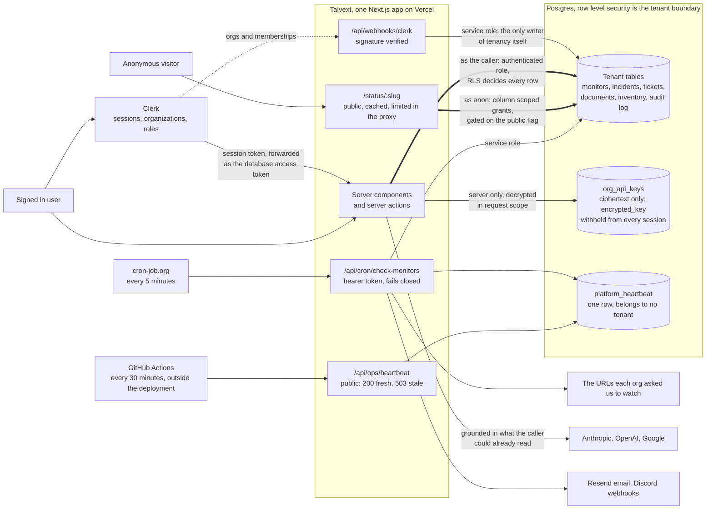

# Talvext architecture

One page. The narrative that explains why it is shaped this way is in
[WRITEUP.md](WRITEUP.md); the rulings behind each choice are in
[DECISIONS.md](DECISIONS.md).

## Reading it

**The two thick edges are the whole tenancy story.** Both cross the Postgres
boundary, and neither one trusts application code to decide what comes back.
The signed in path arrives as `authenticated` carrying the caller's own Clerk
token, so row level security resolves their organization and filters. The public
status page path arrives as `anon`, which holds no policy on anything except
rows whose organization has opted its page public, and column grants cap what
even those rows can reveal to an id, a name, and a slug.

**The dotted edge feeds the only writer of tenancy itself.** Organizations and
memberships arrive from Clerk by webhook, and that route writes on the service
role. No user session holds a verb that writes a role. That is why the role
stored in the database can be trusted as the authority over the role asserted
in the token.

**The sweep is the only thing that runs without a person.** An external
scheduler presents a bearer token every five minutes and the route fails closed
without it. The sweep checks whichever monitors are due, decides incidents,
sends alerts, and stamps the heartbeat row.

**The watcher is deliberately outside the box.** Talvext also monitors Talvext,
but those monitors are checked by the same sweep whose health is in question, so
they freeze on green when it dies. The GitHub workflow is the only thing in this
diagram that can observe the sweep's death, because it is the only thing that
does not depend on the sweep being alive.

**The vault has no edge to the browser, and that is the point.** A provider key
is encrypted before it reaches Postgres, the ciphertext column is withheld from
every signed in session's select grant, and decryption happens on the server in
request scope at the moment of a provider call.

**What the diagram leaves out**, so nobody reads it as complete: the incident
state machine that turns each check result into at most one action, the audit
log triggers that write from inside the same transaction as the change they
record, and the daily digest. All three ride the edges already drawn.
